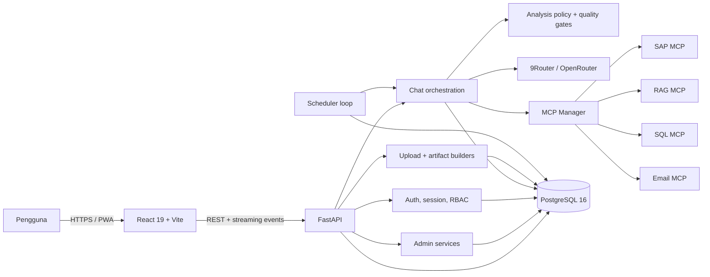
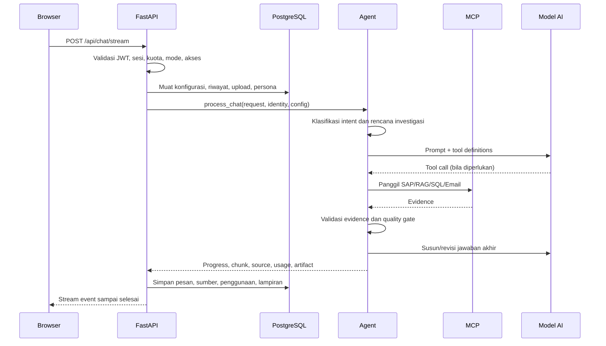

# Arsitektur SAP AI Assistant

> Dokumen acuan arsitektur. Perbarui dokumen ini ketika batas modul, alur data, atau integrasi utama berubah.

## 1. Ringkasan Sistem

Enterprise SAP AI Assistant adalah aplikasi chat AI dalam satu monorepo. Aplikasi menggabungkan antarmuka React, API FastAPI, PostgreSQL, model AI melalui gateway yang dapat dikonfigurasi, serta sumber data eksternal melalui Model Context Protocol (MCP).

Prinsip arsitektur saat ini:

- PostgreSQL adalah satu-satunya database aplikasi; tidak ada fallback SQLite.
- Browser hanya berbicara dengan API backend, bukan langsung dengan model AI, SAP, RAG, SQL, atau layanan email.
- Konfigurasi infrastruktur berada di environment; konfigurasi operasional AI/MCP dikelola di database dan Dashboard Admin.
- Hak akses diperiksa di backend. Penyembunyian menu di frontend bukan kontrol keamanan.
- Jawaban streaming adalah jalur utama chat; endpoint non-streaming dipertahankan sebagai jalur kompatibilitas.
- Data milik pengguna, sesi, upload, dan artifact harus selalu diisolasi berdasarkan pemilik.

## 2. Container dan Integrasi

## 3. Struktur Repository

| Lokasi | Tanggung jawab |
|---|---|
| `frontend/src/components/` | UI chat, pengaturan, diagram, chart, dan halaman admin |
| `frontend/src/hooks/` | State lintas komponen: bahasa, tema, viewport, voice, TTS, streaming |
| `frontend/src/lib/` | API client, i18n, clipboard, Mermaid, ABAP highlighting, device detection |
| `frontend/src/index.css` | Design tokens, tema, layout global, safe-area, dan aturan prose |
| `backend/main.py` | FastAPI app, lifecycle, endpoint, dependency auth, dan orkestrasi request |
| `backend/agent.py` | Orkestrasi model/tool, prompt, streaming, dan jawaban akhir |
| `backend/analysis_policy.py` | Klasifikasi intent, rencana investigasi, dan kecukupan evidence |
| `backend/analysis_strategies.py` | Strategi analisis sesuai intent |
| `backend/evidence_validators.py` | Validasi evidence SAP, SQL, dan RAG |
| `backend/answer_quality.py` | Pemeriksaan kualitas jawaban dan angka yang tidak didukung |
| `backend/mcp_manager.py` | Koneksi dan pemanggilan MCP dinamis |
| `backend/database.py` | Repository data, bootstrap schema, dan transaksi aplikasi |
| `backend/migrations.py` | Migrasi schema sekali-jalan dengan ledger |
| `backend/auth.py` | Password hashing, JWT, dan dependency autentikasi |
| `backend/uploads.py` | Validasi upload dan ekstraksi teks |
| `backend/artifacts.py` | Pembuatan XLSX, CSV, DOCX, dan WRICEF |
| `backend/scheduler.py` | Eksekusi task terjadwal |
| `tests/` | Unit/integration test backend |
| `frontend/e2e/` | Playwright end-to-end test |
| `deploy/` | Script dan konfigurasi deployment; tidak dijalankan otomatis |

## 4. Alur Chat Utama

Tahapan penting:

1. Identitas pengguna dan status server-side session diverifikasi.
2. Kuota token, rate limit, mode chat, target MCP, dan resource access diperiksa.
3. Riwayat dipangkas sesuai token budget; upload yang valid ditambahkan sebagai konteks.
4. Agent memilih skill/prompt yang relevan dan menentukan kebutuhan evidence.
5. Tool mutasi wajib mengikuti kontrol akses dan konfirmasi yang berlaku.
6. Evidence divalidasi sebelum jawaban final; angka yang tidak didukung ditandai oleh quality review.
7. Pesan, sumber, artifact, usage, dan quota dikirim ke UI serta disimpan sesuai kebutuhan.

## 5. Boundary Frontend

`App.jsx` hanya menjadi shell: `ErrorBoundary`, `LanguageProvider`, `ChatLayout`, dan prompt PWA. `ChatLayout.jsx` adalah coordinator utama state sesi/chat. Komponen lain sebaiknya tetap fokus:

- `ChatInput`: composer, attachment, voice input, slash command.
- `ChatMessage`: Markdown/GFM/KaTeX, source, feedback, artifact, edit/regenerate.
- `SidePanel`: navigasi dan riwayat sesi.
- `ModeSelector`: mode AI yang diizinkan untuk pengguna.
- `MermaidDiagram` dan `DataChart`: visualisasi jawaban.
- `SettingsModal`: preferensi/persona/kredensial yang menjadi hak pengguna.
- `AdminDashboard` dan komponen `Admin*`: fungsi superadmin.

Fitur baru yang besar sebaiknya tidak menambah tanggung jawab `ChatLayout`; ekstrak state atau UI menjadi hook/komponen dengan kontrak props yang jelas.

## 6. Boundary Backend

- `main.py` menangani protokol HTTP, validasi request, dependency auth, dan mapping error.
- `agent.py` menangani workflow AI; jangan menaruh SQL atau detail HTTP di sini.
- `database.py` adalah satu-satunya jalur akses data aplikasi. Query harus parameterized.
- `mcp_manager.py` mengabstraksi transport/tool MCP; backend lain tidak bergantung pada bentuk transport spesifik.
- Policy, strategy, validator, dan quality review dipisahkan agar bisa diuji tanpa memanggil model sungguhan.
- Cleanup artifact/upload dan scheduler berjalan sebagai background task pada lifecycle aplikasi.

## 7. Keamanan dan Isolasi

- Password disimpan sebagai bcrypt hash; JWT ditandatangani server.
- Superadmin diverifikasi ulang terhadap database untuk menghindari role lama di token.
- Sesi pengguna memiliki heartbeat, logout, kick, dan audit log.
- Kredensial SAP per pengguna dienkripsi menggunakan Fernet sebelum disimpan.
- Secret tidak boleh dikirim utuh ke browser; endpoint konfigurasi wajib melakukan masking.
- Setiap query sesi, message, upload, dan artifact harus menyertakan owner/username.
- Akses MCP dihitung dari role ditambah override pengguna, lalu diaudit.
- Operasi SAP/program yang mengubah data diperlakukan berbeda dari operasi baca.

## 8. Konfigurasi

Konfigurasi environment (`backend/.env`) digunakan untuk database, JWT, CORS, bootstrap admin, limit infrastruktur, dan fallback awal. Konfigurasi dinamis disimpan dalam `ai_assistant.system_config`, `ai_assistant.mcp_servers`, `ai_assistant.chat_modes`, serta `ai_assistant.skills`.

Urutan praktisnya:

1. Environment menyediakan nilai infrastruktur dan seed/fallback.
2. `init_db()` memastikan schema dasar tersedia.
3. `run_migrations()` menerapkan perubahan schema yang belum tercatat.
4. Dashboard Admin mengelola konfigurasi operasional tanpa mengubah source code.

## 9. Deployment Topology

Pengembangan lokal:

- PostgreSQL 16: `localhost:5432` via Docker Compose.
- FastAPI: port backend lokal (README memakai `8000`; Vite proxy default saat ini memakai `8005`, dapat diubah melalui `VITE_BACKEND_PORT`).
- Vite: `localhost:5173`.

Production menggunakan reverse proxy Nginx dan service backend systemd berdasarkan berkas di `deploy/`. Deployment production tidak boleh dijalankan otomatis dan direktori `/var/www/` tidak boleh disentuh tanpa perintah eksplisit pengguna.

## 10. Keputusan untuk Pengembangan Berikutnya

- Tambahkan endpoint baru pada domain yang sudah ada sebelum membuat service baru.
- Pisahkan business rule yang dapat diuji dari handler HTTP dan komponen visual.
- Gunakan streaming event yang backward-compatible; penambahan tipe event harus aman untuk client lama.
- Gunakan migrasi ledger untuk perubahan schema/data, bukan DDL yang berulang saat startup.
- Catat perubahan lintas boundary di dokumen ini dan fitur terkait di `feature-map.md`.

