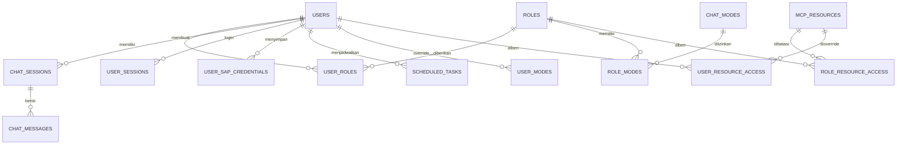

# Mapping Database SAP AI Assistant

> Sumber kebenaran implementasi tetap `backend/database.py` dan `backend/migrations.py`. Dokumen ini menjelaskan tujuan dan relasi, bukan pengganti migration.

## 1. Platform dan Aturan Dasar

- Engine: PostgreSQL 16.
- Database lokal default: `ABAP_DB`.
- Schema aplikasi: `ai_assistant`.
- Driver SQLAlchemy: `postgresql+psycopg`.
- SQLite tidak didukung.
- DDL baru harus idempoten atau masuk ke migration ledger.
- Dilarang menjalankan `DROP`, `TRUNCATE`, atau `DELETE` data tanpa permintaan eksplisit pengguna.
- Seluruh query dari input pengguna wajib parameterized.

## 2. Peta Domain Data

Relasi di atas bersifat konseptual. Beberapa identitas memakai `username`/`role` tanpa foreign key ketat agar migrasi dan konfigurasi dinamis tetap kompatibel.

## 3. Katalog Tabel

### Identitas dan Organisasi

| Tabel | Tujuan | Kunci/relasi penting |
|---|---|---|
| `users` | Akun, nama, password hash, role kompatibilitas, persona, divisi, job level | PK `username`; mengacu secara logis ke `roles` dan `divisions` |
| `roles` | Master role dinamis, label, ikon, status, capability ubah program | PK `code` |
| `user_roles` | Relasi multi-role pengguna | Pasangan `username` + `role` |
| `divisions` | Master divisi, persona, dan tag RAG yang diperbolehkan | PK `code` |
| `user_sap_credentials` | Kredensial SAP terenkripsi per user dan target | PK `username` + `target` |

### Percakapan dan Berkas

| Tabel | Tujuan | Kunci/relasi penting |
|---|---|---|
| `chat_sessions` | Metadata percakapan milik pengguna | PK `session_id`; owner `username` |
| `chat_messages` | Pesan user/assistant, source, attachment, artifact, feedback, usage | PK `id`; FK `session_id` dengan cascade |
| `chat_uploads` | Berkas masuk dan hasil ekstraksi teks dengan TTL | PK `upload_id`; owner + optional session |
| `generated_artifacts` | Binary XLSX/CSV/DOCX/WRICEF hasil AI dengan TTL | PK `artifact_id`; owner + `expires_at` |
| `guest_usage` | Counter penggunaan tamu per client per tanggal | PK `client_key` + `usage_date` |

### AI, MCP, dan Kebijakan Akses

| Tabel | Tujuan | Kunci/relasi penting |
|---|---|---|
| `system_config` | Key-value konfigurasi global/model/persona | PK `key` |
| `skills` | Instruksi domain AI dan tag pemilihan skill | PK numerik |
| `chat_modes` | Provider/model, fallback, iterasi, analysis depth, status/default | PK `id`, unique `code` |
| `role_modes` | Mode yang tersedia per role | PK `role` + `mode_code` |
| `user_modes` | Override mode per pengguna | Identitas user + mode |
| `mcp_servers` | Definisi konektor MCP dinamis dan konfigurasinya | PK server ID |
| `mcp_resources` | Resource/tool MCP yang ditemukan | Key resource kanonis |
| `role_resource_access` | Izin resource pada level role | Role + resource |
| `user_resource_access` | Override izin resource pada level user | User + resource |
| `access_audit` | Jejak perubahan/pemakaian kebijakan akses | Waktu, actor, action, resource |

### Kuota, Jadwal, dan Keamanan

| Tabel | Tujuan | Kunci/relasi penting |
|---|---|---|
| `token_usage` | Agregat token harian per pengguna | PK `username` + `usage_date` |
| `request_log` | Timestamp request untuk rate limit per menit | Index user + waktu |
| `role_limits` | Limit token harian dan request/menit per role | PK `role`; `0` berarti unlimited |
| `scheduled_tasks` | Prompt terjadwal, cron/interval, email, hasil/status run | PK task ID; terkait user |
| `login_attempts` | Counter kegagalan dan lock sementara per client | Client key |
| `user_sessions` | Sesi login, device, heartbeat, status, dan kick | PK session ID; terkait username |
| `auth_audit_logs` | Audit login/logout/kick/peristiwa keamanan | Timestamp, username, event |
| `schema_migrations` | Ledger migration yang sudah diterapkan | PK `name` |

## 4. Data Sensitif dan Retensi

- `password_hash` tidak boleh dibaca ke frontend.
- `user_sap_credentials.encrypted_data` hanya didekripsi sesaat saat koneksi diperlukan.
- API hanya mengembalikan status keberadaan kredensial atau nilai yang dimasking.
- Upload dan generated artifact memiliki waktu kedaluwarsa dan dibersihkan saat startup serta secara berkala.
- Chat dan audit adalah data bisnis; jangan menghapusnya sebagai bagian cleanup biasa.
- Log aplikasi tidak boleh memuat token, password, isi credential, atau file binary.

## 5. Index dan Pola Akses Penting

- Pesan: `(session_id, id)` untuk pagination/render percakapan.
- Sesi: `(LOWER(username), updated_at DESC)` untuk sidebar pengguna.
- Feedback: partial index pada feedback yang terisi.
- History search: GIN trigram pada content/title bila ekstensi `pg_trgm` tersedia.
- Token: tanggal dan total untuk laporan admin.
- Rate limit: `(LOWER(username), created_at DESC)`.
- Artifact/upload: owner dan expiration untuk otorisasi serta cleanup.
- Session security: username, status, heartbeat, dan waktu sesuai query monitor admin.

## 6. Migration Ledger

Migration bernama `_m0001_...` sampai `_m0026_...` saat dokumen ini dibuat. Cakupannya meliputi timezone percakapan, index pencarian/feedback, role dan multi-role, kuota, mode chat, ACL MCP, skills, dynamic MCP, scheduled tasks, divisi/job level, analysis depth, usage per message, serta user session/security log.

Prosedur perubahan schema:

1. Tambahkan fungsi migration baru dengan nomor berurutan di `backend/migrations.py`.
2. Buat perubahan non-destruktif dan kompatibel dengan instalasi lama.
3. Periksa state schema bila migration menggantikan logic lama di `init_db()`.
4. Daftarkan migration pada daftar eksekusi `run_migrations()`.
5. Tambahkan test di `tests/test_migrations.py` atau test domain terkait.
6. Perbarui katalog tabel/relasi dalam dokumen ini.

## 7. Konvensi Query

- Pakai `sqlalchemy.text()` dan bind parameter, bukan interpolasi nilai input.
- Dynamic identifier hanya boleh berasal dari allowlist internal.
- Transaksi write harus eksplisit dan di-commit setelah seluruh invariant terpenuhi.
- Otorisasi owner dilakukan di query, bukan setelah data sensitif terambil.
- Timestamp baru memakai `TIMESTAMPTZ`; tampilkan sesuai locale/timezone di boundary UI.
- Data JSON yang masih disimpan sebagai `TEXT` harus diserialisasi/deserialisasi defensif dan memiliki default aman.

## 8. Backup dan Operasional

- Volume lokal Docker: `sap-ai-pgdata`.
- Backup/restore harus dilakukan dengan tooling PostgreSQL dan diuji di lingkungan non-production.
- Jangan menganggap migration sebagai backup.
- Sebelum perubahan schema besar: ambil backup, uji migration pada salinan data, ukur lock time, lalu siapkan rollback non-destruktif.

