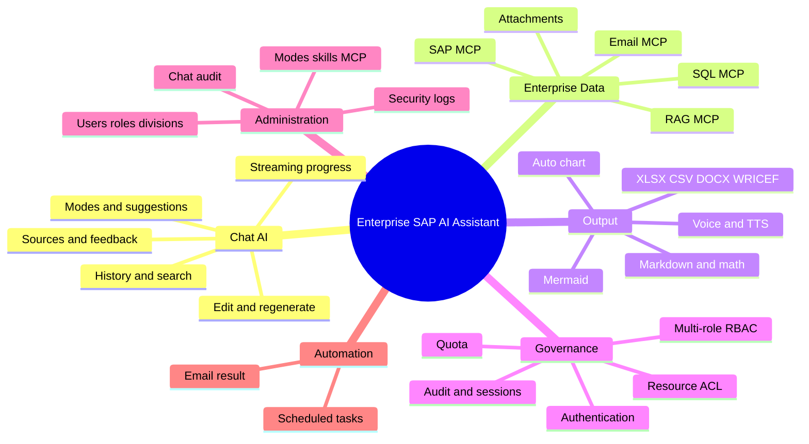

# Feature Map SAP AI Assistant

> Snapshot mapping berdasarkan source code dan test repository. Status: **Aktif** = tersedia; **Parsial** = tersedia tetapi masih memiliki batasan/pekerjaan lanjutan; **Direncanakan** = arah yang disarankan, belum dianggap implementasi.

## 1. Peta Kapabilitas

## 2. User Experience

| Capability | Status | Implementasi utama | Catatan ke depan |
|---|---|---|---|
| Login, logout, forced password change | Aktif | `LoginModal`, `ForceChangePasswordModal`, auth API | Pertahankan audit dan lockout test |
| Chat streaming dengan progress | Aktif | `/api/chat/stream`, `ThinkingIndicator` | Versioning tipe event bila diperluas |
| Riwayat, rename, delete, search sesi | Aktif | session API, `SidePanel` | Pertimbangkan archive bila kebutuhan muncul |
| Edit pertanyaan dan regenerate | Aktif | message truncation + resend UI | Destructive semantics harus jelas |
| Personalized suggestions | Aktif | `/api/chat/suggestions` | Ukur relevansi per role/divisi |
| Mode Fast/Medium/Expert dinamis | Aktif | `chat_modes`, `ModeSelector` | Model/provider dapat dikelola admin |
| Source traceability | Aktif | `SourceReference`, source panel | Pertahankan provenance dan masking |
| Feedback like/dislike | Aktif | feedback API + admin audit | Tambahkan workflow tindak lanjut bila diperlukan |
| Usage dan quota display | Aktif | token usage + `QuotaBanner`/`UsagePill` | Bedakan measured vs estimated |
| Upload image/document | Aktif | upload API, extraction, `ChatInput` | Format dan size tetap dibatasi/dites |
| Voice input dan text-to-speech | Aktif | hooks voice/TTS | Bergantung dukungan browser/HTTPS |
| Light/dark/system theme | Aktif | `useTheme`, semantic tokens | Migrasikan sisa warna literal bertahap |
| Bahasa Indonesia dan English | Aktif | `LanguageProvider`, `i18n.js` | Audit hardcoded legacy copy masih disarankan |
| Installable PWA | Aktif | Vite PWA + prompt | Offline terutama app shell, bukan operasi AI |
| Responsive mobile/desktop | Aktif | safe-area, dynamic viewport, E2E mobile | Regression test wajib untuk modal/tabel |

## 3. AI dan Data Enterprise

| Capability | Status | Implementasi utama | Catatan ke depan |
|---|---|---|---|
| Primary/fallback AI provider | Aktif | 9Router + OpenRouter config | Observability provider/fallback perlu dijaga |
| Intent classification | Aktif | `analysis_policy.py` | Tambahkan kelas hanya bersama test |
| Investigation planning | Aktif | policy + strategies | Hindari tool call tanpa kebutuhan evidence |
| Evidence validation SAP/SQL/RAG | Aktif | `evidence_validators.py` | Tambahkan validator per konektor baru |
| Answer quality gate | Aktif | `answer_quality.py` | Fokus angka dan section contract |
| Context/history compaction | Aktif | `conversation.py` | Ukur kualitas terhadap token budget |
| Dynamic AI skills | Aktif | `skills` + Admin | Tag dan content dikelola database |
| Persona global/user/division | Aktif | config, users, divisions | Definisikan precedence secara konsisten |
| SAP MCP multi-target | Aktif | MCP manager + per-user credentials | Credential tidak pernah tampil utuh |
| RAG MCP | Aktif | MCP manager + allowed tags | Pastikan evidence budget dan divisi |
| SQL MCP | Aktif | MCP manager + ACL | Mutating SQL harus ditolak/dikonfirmasi |
| Email MCP | Aktif | dynamic server seed + tool handling | Send email adalah action sensitif |
| Dynamic MCP registry | Aktif | `mcp_servers` + Admin config/test | Sync resource setelah perubahan tool |
| Resource-level access control | Aktif | role/user matrices + audit | Cache invalidation antar-worker tersedia |

## 4. Output dan Visualisasi

| Capability | Status | Implementasi utama | Catatan ke depan |
|---|---|---|---|
| Markdown dan GFM | Aktif | `react-markdown`, `remark-gfm` | Sanitasi/renderer tetap diawasi |
| Matematika KaTeX | Aktif | `remark-math`, `rehype-katex` | Pastikan fallback plain text |
| ABAP syntax highlight/copy | Aktif | `abapHighlight.js`, `ChatMessage` | Tambah grammar hanya bila ada test |
| Mermaid flowchart | Aktif | `MermaidDiagram` | Ada source view/error fallback |
| Auto table/chart | Aktif | `DataChart` | Identifier tidak dianggap metric |
| XLSX dan CSV artifact | Aktif | `artifacts.py` | Owner check dan TTL wajib |
| DOCX dan WRICEF artifact | Aktif | `artifacts.py` | Template/label mengikuti bahasa/konteks |

## 5. Governance dan Administration

| Capability | Status | Implementasi utama | Catatan ke depan |
|---|---|---|---|
| User management | Aktif | `AdminDashboard`, admin user API | Reset password memaksa perubahan bila dipilih |
| Dynamic master roles + multi-role | Aktif | `roles`, `user_roles`, `AdminRoles` | Role impact sebelum delete |
| Division dan job level | Aktif | `AdminDivisions`, user profile | RAG tags/persona mengikuti divisi |
| Role/user mode matrix | Aktif | `AdminChatModes` | User override harus terlihat jelas |
| Role/user resource matrix | Aktif | `AdminAccessControl` | Effective access harus dapat dijelaskan |
| Token quota dan rate limit | Aktif | quota admin API/tables | Enforcement dapat dimatikan, usage tetap dicatat |
| Chat audit dan feedback review | Aktif | `AdminChatAudit` | Perhatikan data sensitivity |
| Active session monitor/kick | Aktif | `AdminSessionMonitor` | Event masuk auth audit log |
| Security logs/login lock | Aktif | `AdminSecurityLogs` | Retention policy belum terdokumentasi formal |
| System statistics/top users | Aktif | admin stats API | Definisi periode harus konsisten timezone |
| Scheduler task + run now | Aktif | scheduler API/loop/modal | Multi-worker duplicate execution perlu terus diuji |
| Email scheduled result | Aktif | scheduled task + Email MCP | Failure/retry/recipient validation perlu dijaga |

## 6. Roadmap yang Disarankan

Item berikut adalah arah, bukan komitmen implementasi:

### Prioritas 1 — Reliability dan Security

- **Direncanakan:** CI gate baku untuk backend tests, frontend lint/build, dan E2E smoke.
- **Direncanakan:** audit menyeluruh hardcoded UI copy dan penyelarasan seluruhnya ke i18n.
- **Direncanakan:** dokumentasi retention formal untuk chat, audit, upload, dan artifact.
- **Direncanakan:** contract test untuk seluruh event streaming dan reconnect/cancel.
- **Direncanakan:** observability terstruktur untuk model latency, fallback, tool latency, dan quality gate tanpa merekam secret.

### Prioritas 2 — Maintainability

- **Direncanakan:** pecah coordinator besar (`ChatLayout`, `AdminDashboard`, `agent.py`, `database.py`) berdasarkan domain tanpa mengubah behavior.
- **Direncanakan:** OpenAPI/request schema lebih lengkap untuk endpoint admin yang masih memakai dictionary bebas.
- **Direncanakan:** ADR (Architecture Decision Record) untuk perubahan provider, auth, streaming, dan data retention.
- **Direncanakan:** inventaris ownership setiap tabel/endpoint/komponen agar review lintas domain lebih cepat.

### Prioritas 3 — Product Evolution

- **Direncanakan:** archive/export percakapan dengan owner control dan audit.
- **Direncanakan:** workflow kurasi feedback menjadi dataset evaluasi yang sudah disanitasi.
- **Direncanakan:** health dashboard per konektor MCP dan provider AI.
- **Direncanakan:** evaluasi otomatis kualitas jawaban per use case SAP utama.

## 7. Dependency Map Perubahan

| Jika mengubah... | Periksa juga... |
|---|---|
| Auth/JWT/session | `auth.py`, user sessions, heartbeat, audit logs, frontend API handling |
| Role/division/job level | effective role, mode matrix, resource ACL, persona, RAG tags, quota |
| Chat mode/model | mode permission, max iteration, analysis depth, fallback, usage display |
| MCP server/tool | dynamic registry, aliases, resource sync, ACL, evidence validator, source label |
| Streaming event | backend generator, reconnect/cancel, progress logic, E2E progress |
| Message schema | persistence, session history, audit, edit/regenerate, frontend renderer |
| Upload/artifact | MIME/size, owner isolation, TTL cleanup, download response |
| i18n key | `en`, `id`, interpolation, mobile layout, accessibility label |
| Design token | light/dark/system, legacy utilities, charts/diagrams, screenshots/E2E |
| Database schema | bootstrap, next migration, upgrade test, index, this documentation |

## 8. Definition of Done Fitur

- [ ] Acceptance criteria dan hak akses didefinisikan.
- [ ] Data ownership dan audit impact diperiksa.
- [ ] Backend/frontend contract terdokumentasi dan diuji.
- [ ] Failure, empty, loading, retry, dan cancellation state ditangani.
- [ ] UI tersedia dalam `id` dan `en` serta responsif.
- [ ] Schema change non-destruktif dan memiliki migration test.
- [ ] Source/evidence ditampilkan bila jawaban memakai data enterprise.
- [ ] Dokumentasi arsitektur/database/design/feature diperbarui sesuai dampak.
- [ ] Build dan test lokal berhasil sebelum review/push.

